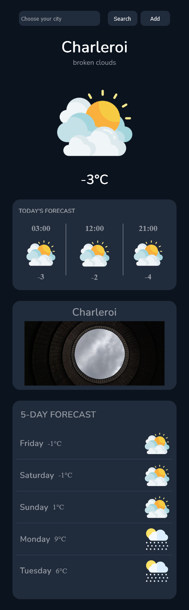
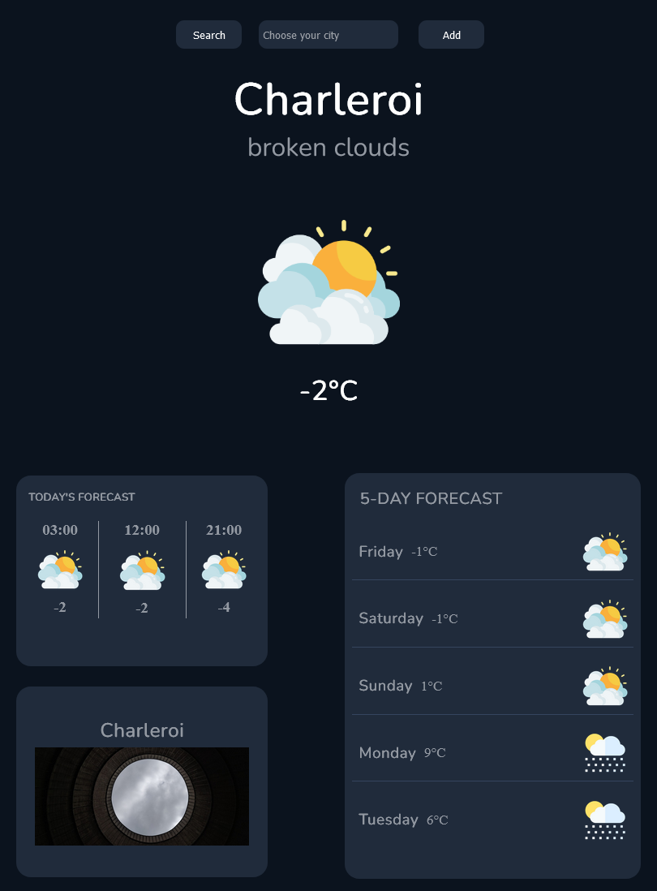
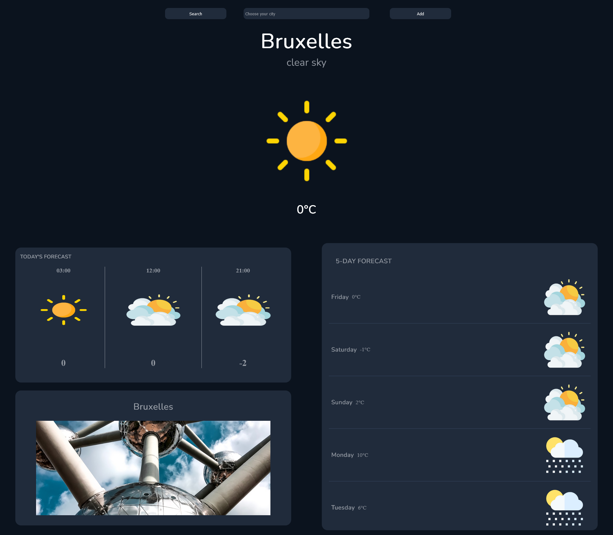

# Weather-App
https://maorohe.github.io/weather-app/

## Table of Contents
1. Why ?
2. Screenshot
3. Technologies

## Why ?
A simple workout that encompasses everything I've learned so far. A basic **Weather-App**!

### Screenshot

### Technologies
- HTML
- SASS (CSS)
- Vanilla JS
- API => Open Weather Map, LocationIQ, Unsplash.
- Libraries => ChartJS
